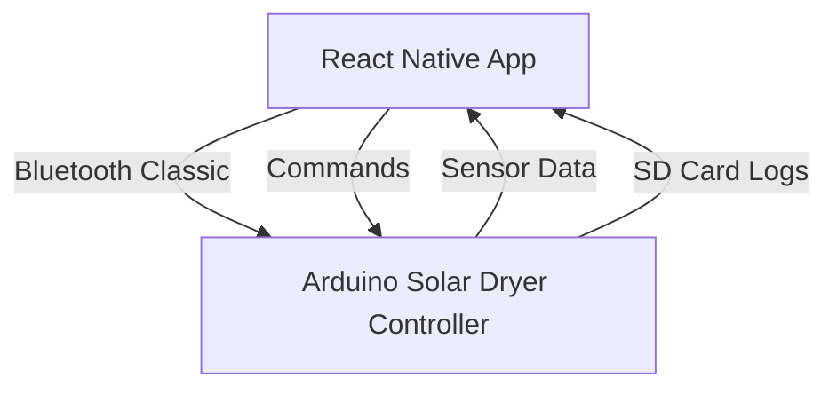

# SOLAR NETRA (Bluetooth Classic Solar Dryer App)

A cross-platform React Native application (with Expo) designed to interface with a custom Arduino-based solar dryer system via Bluetooth Classic. The app enables real-time monitoring, control, and data management for the drying process of fruits and vegetables. The project also includes the Arduino firmware for the solar dryer controller.

---

## Table of Contents
- [Features](#features)
- [Architecture Overview](#architecture-overview)
- [Screenshots](#screenshots)
- [Getting Started](#getting-started)
- [App Usage](#app-usage)
- [Arduino Firmware](#arduino-firmware)
- [Project Structure](#project-structure)
- [Contributing](#contributing)
- [License](#license)

---

## Features
- **Bluetooth Classic Communication**: Connects to the Arduino-based solar dryer controller for real-time data exchange.
- **Drying Process Management**: Start new drying sessions, continue previous sessions, and stop ongoing processes.
- **Live Sensor Data**: View temperature, humidity, weight, and power source (solar/AC) in real time.
- **Settings Management**: Configure calibration, solar thresholds, logging intervals, and more directly from the app.
- **SD Card File Management**: List, download, and view drying session logs stored on the Arduino's SD card.
- **Activity Log**: See a detailed log of all Bluetooth and system events.
- **Cross-Platform**: Built with React Native and Expo for Android (Bluetooth Classic required).

---

## Architecture Overview



- **React Native App**: Provides the user interface, Bluetooth communication, and data management.
- **Arduino Firmware**: Controls sensors, relays, SD card logging, and Bluetooth communication.

---

## Getting Started

### Prerequisites
- Node.js & npm
- [Expo CLI](https://docs.expo.dev/get-started/installation/)
- Android device with Bluetooth Classic support
- Arduino Mega (or compatible) with:
  - DHT22 sensors
  - HX711 load cell
  - SD card module
  - Bluetooth module (e.g., HC-05/HC-06)

### Installation
1. **Clone the repository:**
   ```bash
   git clone <your-repo-url>
   cd bluetooth-classic-app
   ```
2. **Install dependencies:**
   ```bash
   npm install
   ```
3. **Start the Expo app:**
   ```bash
   npx expo start
   ```
4. **Build for Android (optional):**
   ```bash
   npx expo run:android
   ```

---

## App Usage

### 1. **Bluetooth Connection**
- Grant Bluetooth permissions on Android.
- Scan for and connect to the Arduino dryer controller.

### 2. **Drying Process**
- **Start New Drying:** Enter fruit/vegetable name and start time. The app sends a command to the Arduino to begin a new session.
- **Continue Drying:** Resume a previous session using the last log file.
- **Stop Drying:** End the current drying session.

### 3. **Settings**
- Adjust calibration, solar voltage thresholds, dwell times, and logging intervals.
- Save settings to the Arduino (persisted in EEPROM).
- Tare the scale or perform a soft reset.

### 4. **File Management**
- List log files stored on the Arduino's SD card.
- Download selected files to your device.
- View file info and location after download.

### 5. **Activity Log**
- View a real-time log of all Bluetooth and system events for troubleshooting.

---

## Arduino Firmware

The `Solar_Dryer/Solar_Dryer.ino` file contains the firmware for the Arduino-based solar dryer controller. Key features:
- **Sensor Integration:** Reads temperature/humidity (DHT22), weight (HX711), and solar voltage.
- **Relay Control:** Switches between solar and AC power based on voltage thresholds.
- **Bluetooth Command Handling:** Receives commands from the app (start/stop drying, config, file download, etc.).
- **SD Card Logging:** Logs sensor data to SD card with session-based filenames.
- **EEPROM Storage:** Persists configuration and last session info.

**Typical Command Flow:**
- `NEW_DRYING:<fruit>:<date>:<time>` — Start new session
- `CONTINUED_DRYING:<date>:<time>` — Resume previous session
- `STOP` — End session
- `GETCONFIG` / `SET:<key>:<value>` / `SAVECONFIG` — Configuration
- `DOWNLOAD_FILE` / `GET_FILE:<filename>` — File management
- `T` — Tare scale
- `RESET_SYSTEM` — Soft reset

---

## Project Structure

```
bluetooth-classic-app/
├── app/                  # React Native app source
│   ├── index.tsx         # Main entry point
│   └── src/components/   # UI components (modals, context, etc.)
├── android/              # Android native project (for Bluetooth Classic)
├── Solar_Dryer/          # Arduino firmware
│   └── Solar_Dryer.ino   # Main Arduino code
├── assets/               # Images, fonts, splash screens
├── package.json          # Project dependencies
└── ...
```

---

## Contributing

Contributions are welcome! Please open issues or submit pull requests for improvements, bug fixes, or new features.

---

## License

This project is licensed under the MIT License. See [LICENSE](LICENSE) for details. 
